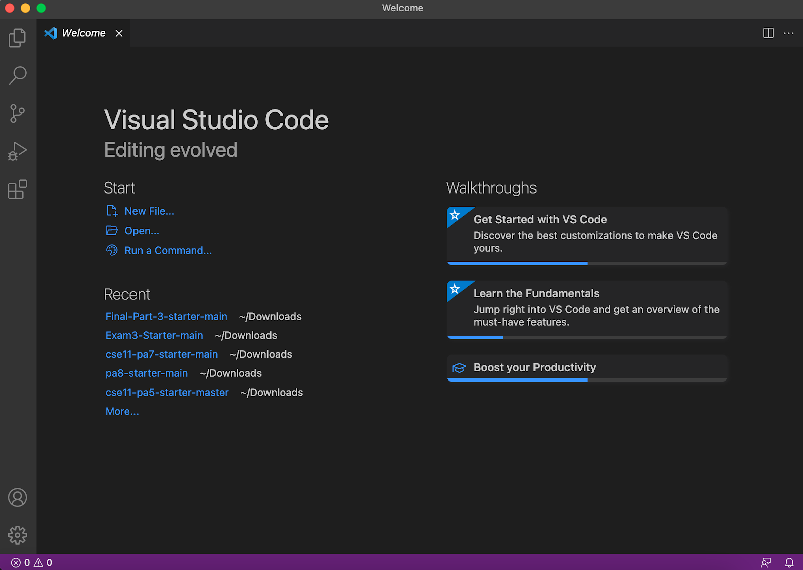

# **LAB REPORT 1**
### 01-14-2021

[HOME](https://jupoon.github.io/cse15l-lab-reports/)

#### **Tutorial: Getting Started in CSE 15L**
Welcome to CSE 15L! This is your comprehensive guide on how to log in to a course-specific account with `ieng6`. Without further ado, let's get started!

#### **Step 1: Installing VS Code**
Go to the [Visual Studio Code](https://code.visualstudio.com/) website and follow the instructions for download and installation on your device. Once you open it, you will get a screen that looks similar to this:



The great thing about VS Code is that there are many available themes you can use to customize the way you want! Dark Mode is the way to go.

#### **Step 2: Remotely Connecting**
This step will get your personal computer connected with one of the computers in the CSE Dungeon. Your personal computer is the *client* and the Dungeon computer is the *server* based on how they are connected.

* Install [OpenSSH](https://docs.microsoft.com/en-us/windows-server/administration/openssh/openssh_install_firstuse)
* Look up your course-specific account for CSE 15L [here](https://sdacs.ucsd.edu/~icc/index.php)
* Go to your newly installed **VS Code** and open up a **New Terminal**.
* Enter in the following, replacing 'zz' with the letters on your course-specific account:

                    ```         ssh cs15lwi22zz@ieng6.ucsd.edu ```

* After hitting enter, type 'yes' if you are prompted the following:

```
The authenticity of host 'ieng6.ucsd.edu (128.54.70.227)' can't be established. 
RSA key fingerprint is SHA256:ksruYwhnYH+sySHnHAtLUHngrPEyZTDl/1x99wUQcec. 
Are you sure you want to continue connecting (yes/no/[fingerprint])? 
```

* Then enter in your password when prompted. 

Success! You have successfully connected your computer to one of the ones in the CSE Dungeon! Their souls are bound together forever now. You should get an output similar to this upon successful login:


#### **Step 3: Trying Some Commands**

#### **Step 4: Moving Files with `scp`**

#### **Step 5: Setting an SSH Key**

#### **Step 6: Optimizing Remote Running**
