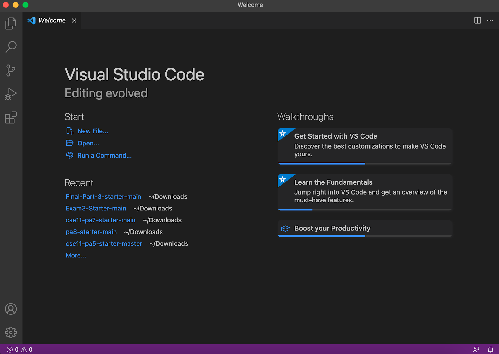
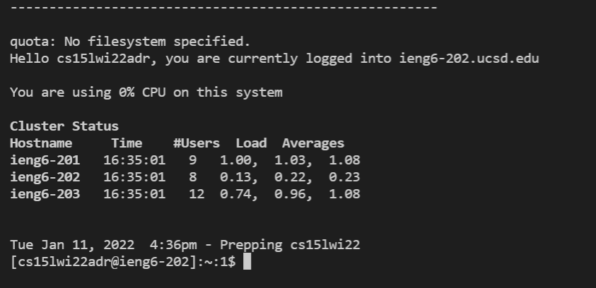
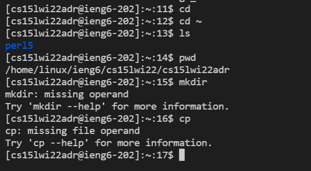
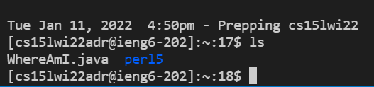
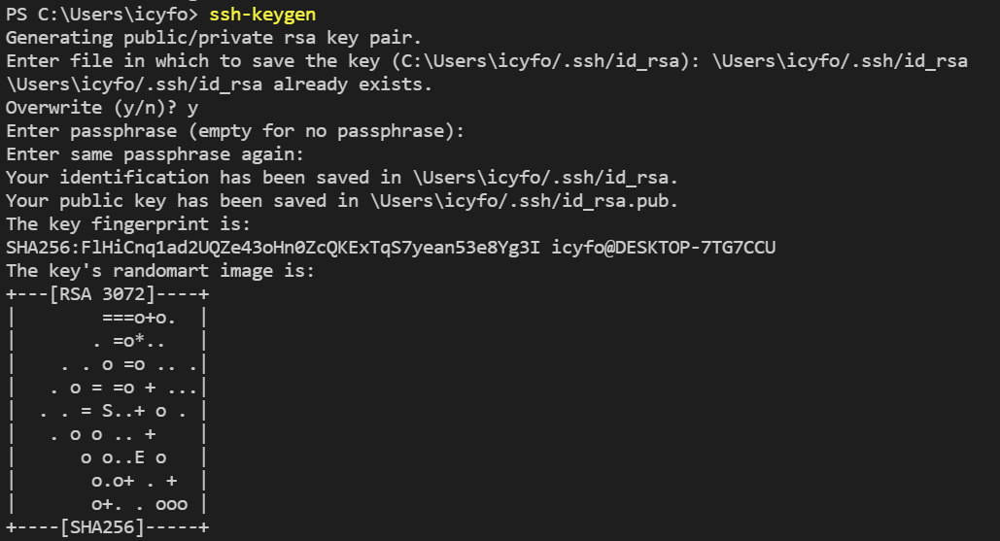
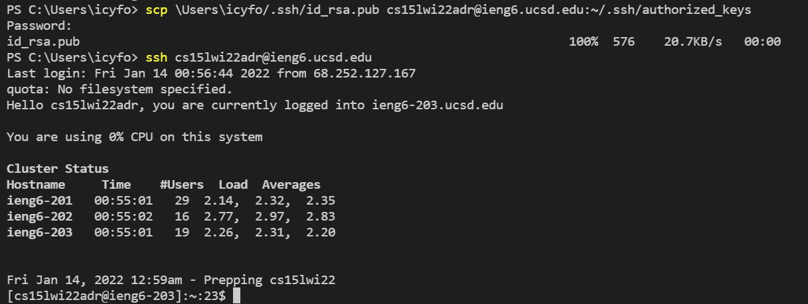
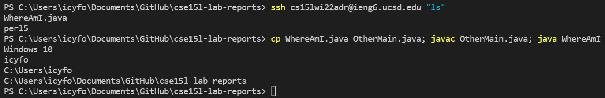

# **LAB REPORT 1**
### 01-14-2022

[HOME](https://jupoon.github.io/cse15l-lab-reports/) &nbsp; &nbsp; &nbsp; &nbsp; &nbsp; &nbsp; [LAB REPORT 2](https://jupoon.github.io/cse15l-lab-reports/lab-report-2)  &nbsp; &nbsp; &nbsp; &nbsp; &nbsp; &nbsp; [CATS](https://jupoon.github.io/cse15l-lab-reports/cats)

#### **Tutorial: Getting Started in CSE 15L**
Welcome to CSE 15L! This is your comprehensive guide on how to log in to a course-specific account with `ieng6`. Without further ado, let's get started!

#### **Step 1: Installing VS Code**
Go to the [Visual Studio Code](https://code.visualstudio.com/) website and follow the instructions for download and installation on your device. Once you open it, you will get a screen that looks similar to this:



The great thing about VS Code is that there are many available themes you can use to customize the way you want! Dark Mode is the way to go.

#### **Step 2: Remotely Connecting**
This step will get your personal computer connected with one of the computers in the CSE Dungeon. Your personal computer is the *client* and the Dungeon computer is the *server* based on how they are connected.

* Install [OpenSSH](https://docs.microsoft.com/en-us/windows-server/administration/openssh/openssh_install_firstuse)
* Look up your course-specific account for CSE 15L [here](https://sdacs.ucsd.edu/~icc/index.php)
* Go to your newly installed **VS Code** and open up a **New Terminal**.
* Enter in the following, replacing 'zz' with the letters on your course-specific account:
            
            ssh cs15lwi22zz@ieng6.ucsd.edu

* After hitting enter, type 'yes' if you are prompted the following:
            
            The authenticity of host 'ieng6.ucsd.edu (128.54.70.227)' can't be established. 
            RSA key fingerprint is SHA256:ksruYwhnYH+sySHnHAtLUHngrPEyZTDl/1x99wUQcec. 
            Are you sure you want to continue connecting (yes/no/[fingerprint])? 

* Then enter in your password when prompted. 

Success! You have successfully connected your computer to one of the ones in the CSE Dungeon! Their souls are bound together forever now. You should get an output similar to this upon successful login:



#### **Step 3: Trying Some Commands**
Try running some commands in your terminal in VS Code, both before and after ssh-ing. Here are some examples of common commands you can run:
* `ls` - shows files
* `mkdir`- makes a folder
* `cd` - changes directory
* `ls -lat` - shows files with more information
* `pwd` - prints working directory

Here's what a terminal running some commands may look like:



To log out of your remote server, you can do Ctrl + D and then the command `exit`.

#### **Step 4: Moving Files with `scp`**
To move files back and forth between your computer and its soulmate in the CSE Dungeons, you will need to learn how to use the command `scp`.

* Create any java file in VS Code on your computer. If you want to follow along with this example, name it `WhereAmI.java` and put the following contents into it:

```
class WhereAmI 
{
  public static void main(String[] args) 
  {
    System.out.println(System.getProperty("os.name"));
    System.out.println(System.getProperty("user.name"));
    System.out.println(System.getProperty("user.home"));
    System.out.println(System.getProperty("user.dir"));
  }
}
```
* Run this command in the terminal from the directory you made this file, replacing 'zz' with the letters from your course account:

            scp WhereAmI.java cs15lwi22zz@ieng6.ucsd.edu:~/

* Log in with the same password you use to log in with `ssh` when prompted for a password
* Then log in to ieng6 with ssh again.
* Using `ls`, you should be able to see the file you created in your directory! This means you'll be able to run your file from the Dungeon computer.



#### **Step 5: Setting an SSH Key**
Let's create an SSH Key so we don't have to re-type our password everytime we log in or run a `scp` command on this computer.
* Run `ssh-keygen` on the terminal of your client computer
* Then run on your terminal what you need to match the following:



* Copy the public key to your `.ssh` directory by running the following, replacing with the appropriate names and path you saw in the command above:

```
ssh cs15lwi22zz@ieng6.ucsd.edu
<Enter Password>
# now on server
$ mkdir .ssh
$ <logout>
# back on client
$ scp /Users/joe/.ssh/id_rsa.pub cs15lwi22@ieng6.ucsd.edu:~/.ssh/authorized_keys
```
After you enter in that last command and enter in your password once again, you won't ever have to retype your password on your client computer again! Notice how it does not prompt for a password when we log in using `ssh` now:
 

 
#### **Step 6: Optimizing Remote Running**
Now you can use what you learned to make the process of remotely editing your programs even easier. Here are just two examples of things you can do to optimize running remotely:
* **write a command in quotes** directly after an ssh command to directly run the command on the remote server, then exit.

            ssh cs15lwi22zz@ieng6.ucsd.edu "ls"
            # this command will log in and list the home directory on the remote server

This saves you a keystroke when compared to the following code, which takes 2 keystrokes to accomplish:
            
            $ ssh cs15lwi22zz@ieng6.ucsd.edu 
            $ ls            

* **use semicolons to run multiple commands** in the same line. Here's an example:

            cp WhereAmI.java OtherMain.java; javac OtherMain.java; java WhereAmI

Compared to the following code, which takes 2 more keystrokes to accomplish:

            $ cp WhereAmI.java OtherMain.java
            $ javac OtherMain.java
            $ java WhereAmI

Here's what you could see after trying both those commands:




#### **And that's a wrap! With just a bit more practice, you'll be a pro at creating, moving, editing, and running files back and forth between your client and server. Best of luck in your future CSE adventures!**


