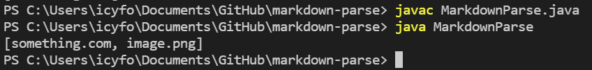
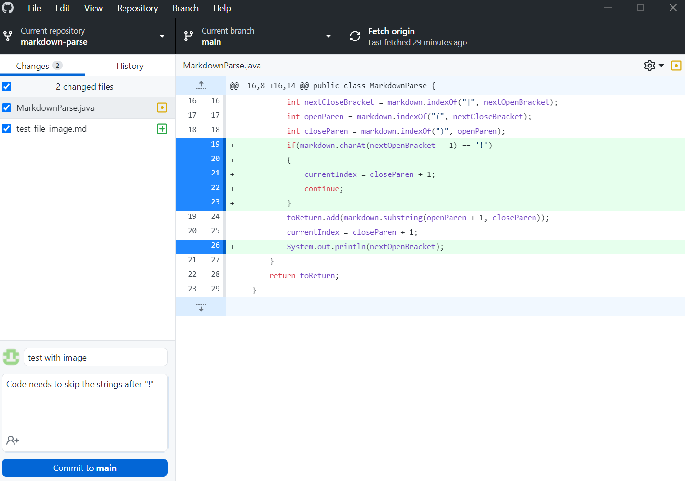
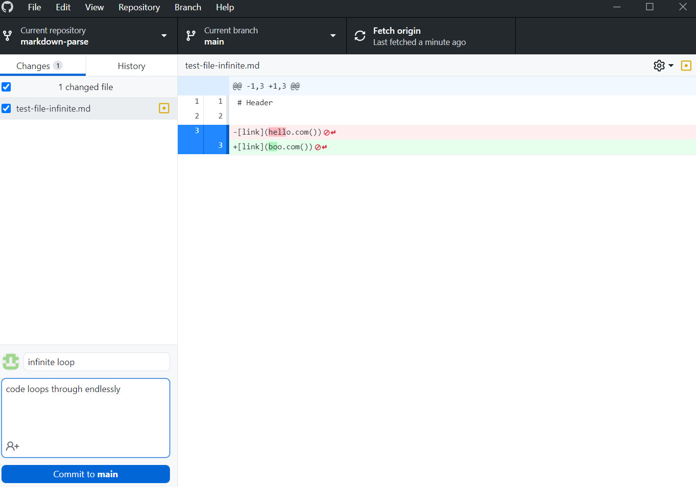
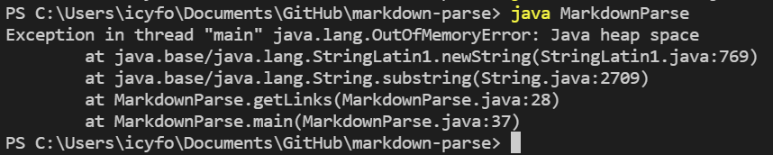
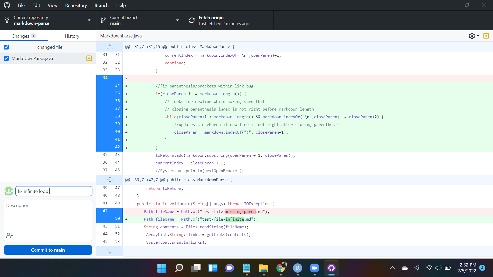
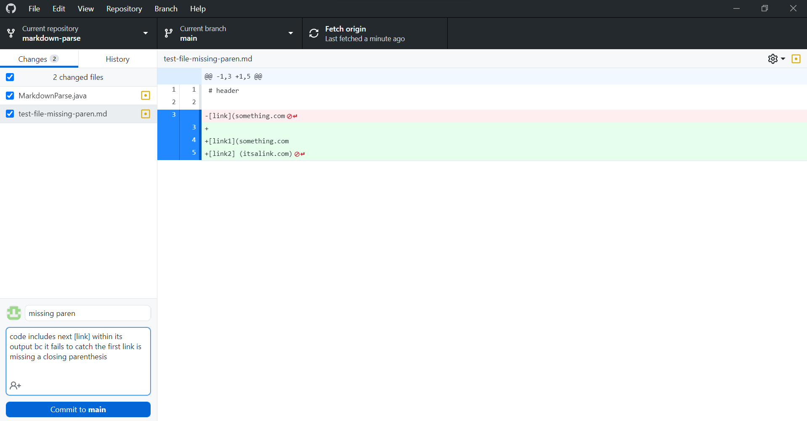
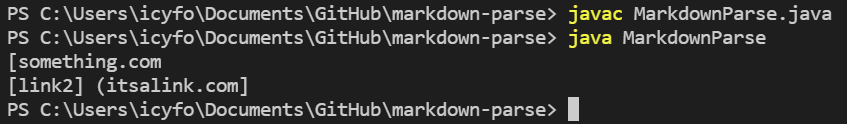
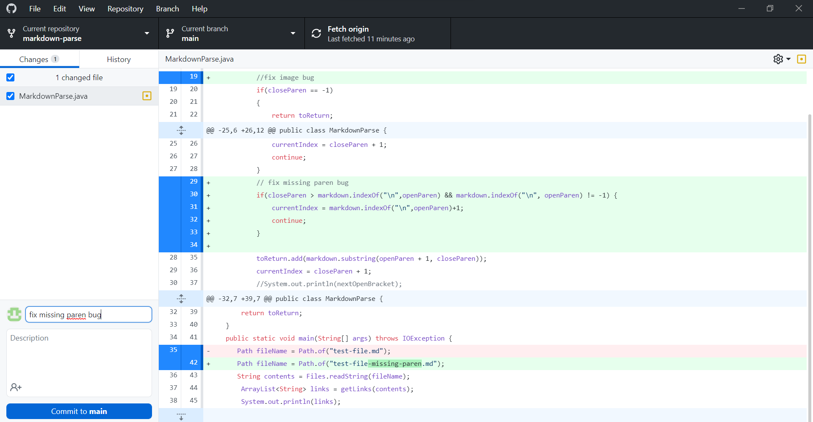

# **LAB REPORT 2**
### 01-28-2022

[HOME](https://jupoon.github.io/cse15l-lab-reports/) &nbsp; &nbsp; &nbsp; &nbsp; &nbsp; &nbsp; [LAB REPORT 1](https://jupoon.github.io/cse15l-lab-reports/labs/lab1/lab-report-1-week-2) &nbsp; &nbsp; &nbsp; &nbsp; &nbsp; &nbsp; [LAB REPORT 3](https://jupoon.github.io/cse15l-lab-reports/labs/lab3/lab-report-3)

### **Code Failure 1: File with Image**
* The first bug we found was when we run the code with a file that includes an image. The link to the test file with an image [here](https://github.com/jupoon/markdown-parse/commit/45b2fb3be4c3c3c2c1a5d0ca835b28a37eab3436#diff-5e1629e7c03be1693e513eb19ba88fd156b54d65a3275587ab6afeb297796508)
* The problem with the code is that it fails to catch the '!' character before brackets that indicate images, not links. This means that it includes the name of the image file when we are strictly looking for links. You can see the output of running MarkdownParse.java below with the image file:

 

* Instead of only producing `[something.com]`, it produces `[something.com, image.png]`. Here's a screenshot of a code change diff that we use to solve this problem:
 
 

### **Code Failure 2: Link with Parenthesis**
* Another problem occurs when we test a file with a link that has its own set of parenthesis within the link. An example of this failure inducing can be seen below, or access through this [link](https://github.com/jupoon/markdown-parse/commit/53f77d6d68bd08d6f58d1f1fc8e99ecfaa95625c#diff-9fef0e551f4300d94bd5d681e8159101f4b3124d0de85fad00dec77958c7e458).

* The code fails to correctly identify the last closed parenthesis character ')' as the true `closeParen`, and thus causes an infinite loop when run. We can see the symptom of this bug in the picture below:

* Here's a screenshot of the code change we made to catch links with parenthesis:

### **Code Failure 3: File Missing Parenthesis**
* Finally, we identified a problem when the file includes input that doesn't include a closing parenthesis. 

* In this [file](https://github.com/jupoon/markdown-parse/commit/acf543590ddfd1331ecece70c3354644ae5b8818#diff-3c17df138517d6d9e4ca0eee79c77cad30bb772bfde04e5d84f7d35605730952), the user forgets to include a closing parenthesis for the first link. Ideally the code would skip this invalid input, and produce output that only includes the second link, `[itsalink.com]`. Instead, this is the output after running the code:

* The code change we made to solve this problem can be seen below:

### **okay bye bye until next week!**

