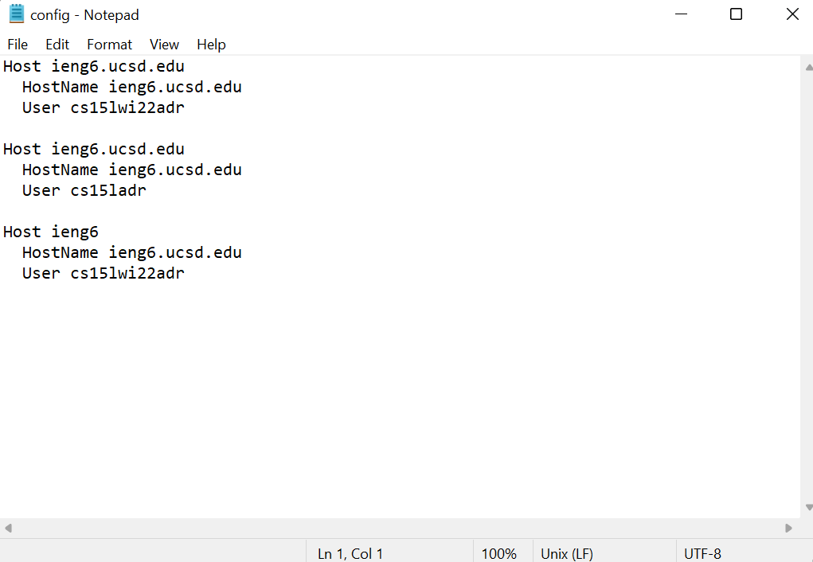
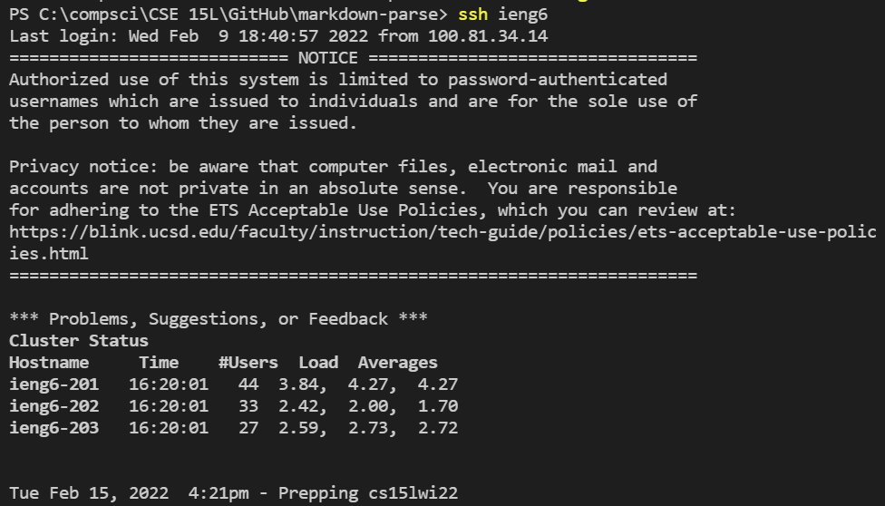
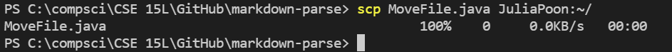

# **LAB REPORT 3**
### 02-11-2022

[HOME](https://jupoon.github.io/cse15l-lab-reports/) &nbsp; &nbsp; &nbsp; &nbsp; &nbsp; &nbsp; [LAB REPORT 1](https://jupoon.github.io/cse15l-lab-reports/labs/lab1/lab-report-1-week-2) &nbsp; &nbsp; &nbsp; &nbsp; &nbsp; &nbsp; [LAB REPORT 2](https://jupoon.github.io/cse15l-lab-reports/labs/lab2/lab-report-2)

Streamlining ssh Configuration
Show your .ssh/config file, and how you edited it (with VScode, another program, etc)
Show the ssh command logging you into your account using just the alias you chose.
Show an scp command copying a file to your account using just the alias you chose.

### **Streamlining SSH Configuration**

Isn't it annoying to have to type in the `ssh` command every time you want to access your `ieng6` account? In this lab, we'll learn how to streamline SSH configuration. 

#### **Step 1: Edit Your `~/.ssh/config` File**
Open a new terminal and type in the command `~/.ssh/config`. It should then give you option of what type of file you want to open your `~/.ssh/config` file with. I chose to use the Notepad app. Edit your `~/.ssh/config` file so that you add the following lines:

        Host ieng6
            HostName ieng6.ucsd.edu
            User cs15lwi22zzz (use your username)

Here is what my file looks like:

#### **Step 2: Log In With Your Username**
Type in the command 
        ssh  ieng6

You should see an output similar to this:

Now that you see how it works, you can now go back to your `~/.ssh/config` file and edit your Host from `ieng6` to be whichever name you'd like to access your ssh account! Below, I chose to edit Host to my name, JuliaPoon.

        Host JuliaPoon
            HostName ieng6.ucsd.edu
            User cs15lwi22adr

#### **Step 3: Practice Copying Over Files With Your Username**

As we remember from [Lab Report 1](https://jupoon.github.io/cse15l-lab-reports/labs/lab1/lab-report-1-week-2), you can copy over files using the `scp` command. Let's try this using our new username! Log out of your ieng6 account first, and open a new terminal. I will type in this following command to copy over a new file I just created in VSCode, MoveFile.java, to practice moving this with my new ieng6 username.

        scp MoveFile.java JuliaPoon

And you can see here that this command is successful!

#### **Congrats! You have streamlined your SSH configuration!! Coding cat is very proud of you**

