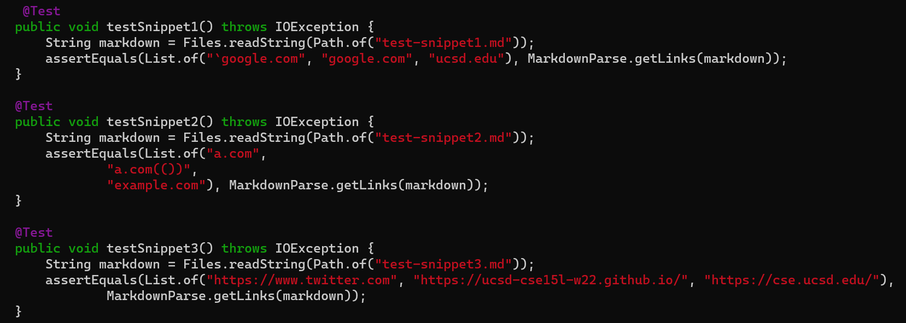
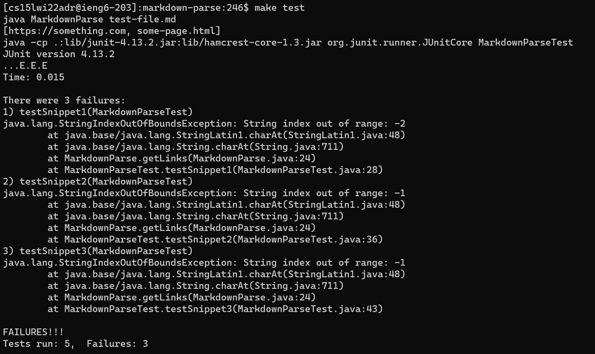
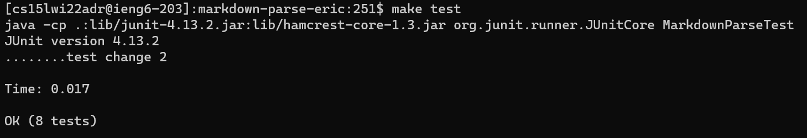

# **LAB REPORT 4**
### 02-25-2022

[HOME](https://jupoon.github.io/cse15l-lab-reports/) &nbsp; &nbsp; &nbsp; &nbsp; &nbsp; &nbsp; [LAB REPORT 1](https://jupoon.github.io/cse15l-lab-reports/labs/lab1/lab-report-1-week-2) &nbsp; &nbsp; &nbsp; &nbsp; &nbsp; &nbsp; [LAB REPORT 2](https://jupoon.github.io/cse15l-lab-reports/labs/lab2/lab-report-2) &nbsp; &nbsp; &nbsp; &nbsp; &nbsp; &nbsp; [LAB REPORT 3](https://jupoon.github.io/cse15l-lab-reports/labs/lab3/lab-report-3)

[My markdown-parse repository](https://github.com/jupoon/markdown-parse)
[Reviewed markdown-parse repository](https://github.com/ericwpei/markdown-parse)

In today's lab we'll be testing three different test files on both my own code, and the code I reviewed. First let's review our test files and establish what they should produce.

#### **Test Snippet 1**
Test Snippet 1 looks like this:

        `[a link`](url.com)

        [another link](`google.com)`

        [`cod[e`](google.com)

        [`code]`](ucsd.edu)

And it should produce a result like this:

**************************************************

`[a link`](url.com)

[another link](`google.com)`

[`cod[e`](google.com)

[`code]`](ucsd.edu)

**************************************************

#### **Test Snippet 2**

Test Snippet 2 looks like this:

        [a [nested link](a.com)](b.com)

        [a nested parenthesized url](a.com(()))

        [some escaped \[ brackets \]](example.com)

And it should produce a result like this:

**************************************************

[a [nested link](a.com)](b.com)

[a nested parenthesized url](a.com(()))

[some escaped \[ brackets \]](example.com)

**************************************************

#### **Test Snippet 3**

Test Snippet 3 looks like this:

        [this title text is really long and takes up more than 
        one line

        and has some line breaks](
            https://www.twitter.com
        )

        [this title text is really long and takes up more than 
        one line](
            https://ucsd-cse15l-w22.github.io/
        )

        [this link doesn't have a closing parenthesis](github.com

        And there's still some more text after that.

        [this link doesn't have a closing parenthesis for a while](https://cse.ucsd.edu/

        )

        And then there's more text

And it should produce a result like this:

**************************************************

[this title text is really long and takes up more than 
one line

and has some line breaks](
    https://www.twitter.com
)

[this title text is really long and takes up more than 
one line](
    https://ucsd-cse15l-w22.github.io/
)

[this link doesn't have a closing parenthesis](github.com

And there's still some more text after that.

[this link doesn't have a closing parenthesis for a while](https://cse.ucsd.edu/

)

And then there's more text

**************************************************

Here are the tests I created in MarkdownParseTest.java for each of the three test snippets:

Here was the output of my run for the three tests with my code:

As you can see from the screenshot, my code did not pass the tests for the new test snippets.

Here was the output of the run for the three tests using the code I reviewed:

As you can see, the reviewed code from another group passed all the tests that included the new test snippets.

***************************************************

From the output of my tests, it looks like they produce the same error for all 3 test snippets --  that means there is a specific part in my code that is causing the index of out bounds exception. Looking at my code further, I can identify it as a problem occurring at the if statement and subsequent while loop at lines 36 and 39, respectively, where closeParen is not being updated properly. 

Instead of having this condition as part of the while loop,

`markdown.indexOf("\n",closeParen) != closeParen+1`

it should be changed to this:

`markdown.indexOf("\n",closeParen) != closeParen+2`

However, this is just the start -- this small code change would fix the initial problem with my code and the out of bounds exception, but it does not necessarily mean this change will account for other problems not covered by my code in the test snippets. That would require a more involved change by examining the different cases and why/how they fail, if they should.

*****************************************************

**Thanks for reading!**

