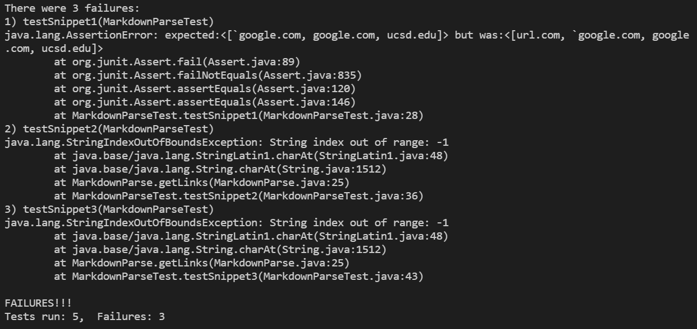

# **LAB REPORT 4**
### 02-25-2022

[HOME](https://jupoon.github.io/cse15l-lab-reports/) &nbsp; &nbsp; &nbsp; &nbsp; &nbsp; &nbsp; [LAB REPORT 1](https://jupoon.github.io/cse15l-lab-reports/labs/lab1/lab-report-1-week-2) &nbsp; &nbsp; &nbsp; &nbsp; &nbsp; &nbsp; [LAB REPORT 2](https://jupoon.github.io/cse15l-lab-reports/labs/lab2/lab-report-2) &nbsp; &nbsp; &nbsp; &nbsp; &nbsp; &nbsp; [LAB REPORT 3](https://jupoon.github.io/cse15l-lab-reports/labs/lab3/lab-report-3) &nbsp; &nbsp; &nbsp; &nbsp; &nbsp; &nbsp; [LAB REPORT 5](https://jupoon.github.io/cse15l-lab-reports/labs/lab5/lab-report-5)

[My markdown-parse repository](https://github.com/jupoon/markdown-parse)

[Reviewed markdown-parse repository](https://github.com/ericwpei/markdown-parse)

In today's lab we'll be testing three different test files on both my own code, and the code I reviewed. First let's review our test files and establish what they should produce.

#### **Test Snippet 1**
Test Snippet 1 looks like this:

        `[a link`](url.com)

        [another link](`google.com)`

        [`cod[e`](google.com)

        [`code]`](ucsd.edu)

And it should produce a result like this:

**************************************************

`[a link`](url.com)

[another link](`google.com)`

[`cod[e`](google.com)

[`code]`](ucsd.edu)

**************************************************

#### **Test Snippet 2**

Test Snippet 2 looks like this:

        [a [nested link](a.com)](b.com)

        [a nested parenthesized url](a.com(()))

        [some escaped \[ brackets \]](example.com)

And it should produce a result like this:

**************************************************

[a [nested link](a.com)](b.com)

[a nested parenthesized url](a.com(()))

[some escaped \[ brackets \]](example.com)

**************************************************

#### **Test Snippet 3**

Test Snippet 3 looks like this:

        [this title text is really long and takes up more than 
        one line

        and has some line breaks](
            https://www.twitter.com
        )

        [this title text is really long and takes up more than 
        one line](
            https://ucsd-cse15l-w22.github.io/
        )

        [this link doesn't have a closing parenthesis](github.com

        And there's still some more text after that.

        [this link doesn't have a closing parenthesis for a while](https://cse.ucsd.edu/

        )

        And then there's more text

And it should produce a result like this:

**************************************************

[this title text is really long and takes up more than 
one line

and has some line breaks](
    https://www.twitter.com
)

[this title text is really long and takes up more than 
one line](
    https://ucsd-cse15l-w22.github.io/
)

[this link doesn't have a closing parenthesis](github.com

And there's still some more text after that.

[this link doesn't have a closing parenthesis for a while](https://cse.ucsd.edu/

)

And then there's more text

**************************************************

Here are the tests I created in MarkdownParseTest.java for each of the three test snippets:

Here was the output of my run for the three tests with my code:

As you can see from the screenshot, my code did not pass the tests for the new test snippets.

Here was the output of the run for the three tests using the code I reviewed:

As you can see, the reviewed code from another group passed all the tests that included the new test snippets.

***************************************************

#### **Questions**

1. Do you think there is a small (<10 lines) code change that will make your program work for snippet 1 and all related cases that use inline code with backticks? If yes, describe the code change. If not, describe why it would be a more involved change.

* Yes, I think there is a small code change less than 10 lines that can make my program work for snippet 1. I would need to include code that takes into account for any pair of backticks that appear between a set of parenthesis. This also includes any backticks that appear before brackets. To do so, we can use `indexOf()` to search for pairs of backticks within each substring of the open and closing parenthesis for each link. We can also use it to search for any backticks that occur before the open brackets, and if there exists a second backtick on the same line. Using a while loop, remove the occurrences of links with backticks.

2. Do you think there is a small (<10 lines) code change that will make your program work for snippet 2 and all related cases that nest parentheses, brackets, and escaped brackets? If yes, describe the code change. If not, describe why it would be a more involved change.

* No, I do not think there is a small code change that could fix my program for test snippet 2. Based on my test run, there is a string index out of bounds exception, which probably means the large amount of open and closing brackets/parenthesis aren't accounted for correctly by my implementation. I would first have to fix this issue of updating my openParen and closeParen variables correctly, before then figuring out how to identify the correct open & close parenthesis/brackets according to Markdown rules. One solution is to parse the test file into separate lines, and examine the code line by line for nested brackets and parenthesis. This code change cannot easily be done in under 10 lines.

3. Do you think there is a small (<10 lines) code change that will make your program work for snippet 3 and all related cases that have newlines in brackets and parentheses? If yes, describe the code change. If not, describe why it would be a more involved change.

* Similar to test snippet 2, I got a string index out of bounds exception when I tried to run my code with this test. However, even though it failed, I believe I can make a code change of less than 10 lines to solve this problem. In my current MarkdownParse implementation, I have a lot of code that checks for new lines to help update closeParen, and the index out of bounds exception is due to the fact that my code does not correctly update closeParen (due to the large amount of new lines) and causes it to check out of bounds. After I fix this, I can use the `indexOf()` method to check if there are new line breaks within each set of brackets and parenthesis; if there are, then we exit the current iteration of the while loop and look for the nextOpenBracket.

*****************************************************

**Thanks for reading!**

