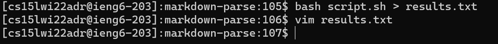

# **LAB REPORT 5**
### 03-11-2022

[HOME](https://jupoon.github.io/cse15l-lab-reports/) &nbsp; &nbsp; &nbsp; &nbsp; &nbsp; &nbsp; [LAB REPORT 1](https://jupoon.github.io/cse15l-lab-reports/labs/lab1/lab-report-1-week-2) &nbsp; &nbsp; &nbsp; &nbsp; &nbsp; &nbsp; [LAB REPORT 2](https://jupoon.github.io/cse15l-lab-reports/labs/lab2/lab-report-2) &nbsp; &nbsp; &nbsp; &nbsp; &nbsp; &nbsp; [LAB REPORT 3](https://jupoon.github.io/cse15l-lab-reports/labs/lab3/lab-report-3) &nbsp; &nbsp; &nbsp; &nbsp; &nbsp; &nbsp; [LAB REPORT 4](https://jupoon.github.io/cse15l-lab-reports/labs/lab4/lab-report-4) 

#### **Intro**

Today we will be reviewing my lab groups code when ran with the commonmark-spec tests. To run the tests, we used something called bash scripting to run all 652. The command looks like this:

`bash script.sh > results.txt`

and we can then use vim to look at results.txt where the output is stored.

But out of all 652 test results, how do I check which results I have that differ from the professors? I ran this line of code in order to see.

`diff lab9/results.txt lab9_mine/results.txt`

Out of all the tests where there were code differences, I chose

